# ✦ Starfallen ✦

*The sky is falling — and something came with it.*

**Starfallen** is a content mod for **Minecraft Java Edition 1.20.1** on **Forge 47.4.10**. Meteor showers light up the night and
crash into the world, leaving glowing craters full of alien metal. Cosmic creatures follow them down. A haunted observatory
points the way to a buried sanctum, and at the bottom of that sanctum something enormous is waiting to wake up.

Everything is made from scratch: every model, texture, animation, particle and sound effect, plus a looping boss theme.
It needs no other mods or libraries.

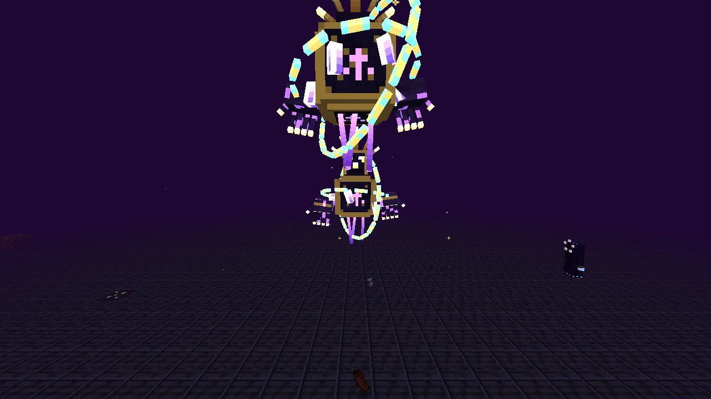

---

## Installation

**Requirements:** Minecraft Java Edition **1.20.1** and Forge **47.4.10** (any Forge 47.4.x or newer 1.20.1 build works). There are
**no dependencies**. You only need `starfallen-1.0.0.jar`.

**The jar:** [`release/starfallen-1.0.0.jar`](release/starfallen-1.0.0.jar)

### CurseForge app
1. **Create Custom Profile** → Minecraft **1.20.1** → Modloader **Forge** → version **47.4.10**.
2. Open the profile, click **⋮ → Open Folder**, and put `starfallen-1.0.0.jar` in the `mods` folder.
   (If the folder doesn't exist yet, launch the profile once and it will be created.)
3. Launch. The mod list should show **Starfallen** with its logo.

### Vanilla launcher / servers
1. Install Forge 1.20.1-47.4.10 from <https://files.minecraftforge.net>.
2. Put the jar in `.minecraft/mods`. For a server, put it in the server's `mods` folder too; clients need the mod as well.

> **Tip:** The Structures are generated in **new chunks**, so start a fresh world (or explore new terrain) to find the Observatory and the Sanctum.

---

## Showcase in 5 minutes (for recording)

Everything can be shown in one creative world with commands. All commands need cheats / OP.

| Command | What it does |
|---|---|
| `/starfallen kit all` | Gives every weapon, armor set, gadget and material (`weapons`, `armor`, `gadgets`, `materials`, `blocks` also work) |
| `/starfallen starfall start [ticks]` | Starts a **Starfall**: title card, violet sky, shooting stars, meteors crashing near every player |
| `/starfallen starfall stop` / `status` | Ends the event / shows whether one is active |
| `/starfallen meteor [normal\|large\|golden\|egg]` | Calls one meteor down in front of you (`golden` = treasure crater, `egg` = Stellar Egg) |
| `/starfallen boss` | Awakens **Astraeon** 10 blocks in front of you, with the full cinematic |
| `/starfallen highseer` | Summons the **High Starseer** mini-boss |
| `/starfallen mimic` | Places an **Astral Mimic** (a "chest"… open it!) |
| `/locate structure starfallen:astral_observatory` | Finds the nearest Astral Observatory |
| `/locate structure starfallen:sanctum` | Finds the nearest Sanctum of the Fallen Star |

All items are also in the **Starfallen** creative tab (tab page 2).

**Suggested video flow**
1. Start at night with `/time set 13000`, then `/starfallen starfall start`. Look up to see the shooting stars and the nebula band, then watch the meteors hit the ground.
2. Walk into a fresh crater. Mine Meteoric Iron, break the **Fallen Star**, and watch out for the **Meteor Golem** that rode it down.
3. `/starfallen meteor golden` and `/starfallen meteor egg`. Feed the **Stellar Egg** Stardust three times to hatch it, then ride your new **Comet Ray**.
4. Visit the **Astral Observatory**, beat the High Starseer, and look through the telescope to get the **Sanctum Chart** map.
5. Enter the **Sanctum**: traps, the Void Stalker hall, the crystal cavern, and the secret library door. Light the four braziers, break the Seal, and place the **Sigil** on the **Star Altar**.
6. Fight **Astraeon**, then forge the **Halo**, the **Eclipse Scythe** and the **Totem of the Fallen Star** from its heart.

---

## The adventure

### 🌠 Starfall nights
On any night there is a 20 % chance of a **Starfall** (configurable). A title card announces it, the sky turns violet, a nebula
band arches overhead and shooting stars streak across it. Real meteors scream down every few seconds near each player:
- They carve **molten craters** lined with **Meteorite**, **Meteoric Iron Ore** and **Starlit Crystals** (which drop Stardust).
- **Large meteors** leave a **Fallen Star** at the core (break it for Star Fragments). Sometimes a **Meteor Golem** climbs out.
- **Golden Meteors** (rare) fill their crater with gold, diamonds and emeralds.
- **Egg meteors** carry a **Stellar Egg**. It hatches over a few minutes (right away if you feed it Stardust) into a Comet Ray tamed to the nearest player.
- Wild **Comet Rays** glide through the sky during a Starfall.

Ancient, cooled **craters** also generate naturally across the Overworld.

### 🏛 The Astral Observatory (surface structure)
A white-and-gold tower with a glass dome, found in plains, meadows, savannas, deserts, badlands and snowy plains. It has
four floors: a starfield-mosaic hall, a library, an alchemy lab, and the dome with its great telescope. Starseers live
inside and the **High Starseer** guards the dome. Look through the **Astral Telescope** and it shows you the nearest Sanctum, handing
you a **Sanctum Chart** map. At night the stars answer your gaze with a falling meteor. There is at least one chest that isn't
a chest, and a secret under the red carpet.

### 🕳 The Sanctum of the Fallen Star (dungeon)
A lonely obelisk marks a spiral shaft down to a huge void-brick dungeon:
- **Hall of Stars:** the central hub, with a starfield floor.
- **Library:** books, lore and a riddle. One carved bookshelf hides the way to the **Vault**, which holds the **Sigil of the Fallen Star** (and a mimic).
- **Trap Gallery:** pressure spike traps, flame jets, arrow dispensers, a crumbling bridge over a spike pit, and Sentinel Eyes.
- **Crystal Cavern:** a glowing cave of Starlit Crystals with a Meteor Golem, Nebula Jellies and a brazier on a high ledge.
- **Hall of Watchers:** alcoves, a caged spawner and **Void Stalkers**. Don't blink.
- **The Seal:** a wall of living starlight. Light the **four Astral Braziers** hidden around the dungeon (Stardust, flint & steel or a fire charge) and it dissolves.
- **Heart Chamber:** a domed arena with cover pillars and the **Star Altar**.

### ☀ Boss: Astraeon, the Devouring Star
Place the Sigil on the Star Altar. A pillar of starlight strikes the altar, the sky goes dark, the camera shakes, and
Astraeon rises with a title card and its own music. It has 600 HP and a 40-damage cap per hit (so every weapon matters).
Its attacks:
- **Star Volley:** homing star bolts.
- **Meteor Rain:** meteors called down around you.
- **Slam:** it crashes down and releases a ground shockwave that you have to jump. It is stunned afterwards and takes extra damage.
- **Charge:** a ramming dash.
- **Void Beam:** a charged beam that tracks you. Break line of sight behind the pillars.
- **Singularity:** a black hole that drags you in.
- **Phase 2 "Unbound"** at 50 % HP: a red boss bar and faster, harder attacks.
- **Supernova** below 30 %: a huge warned blast. Hide behind a pillar!

It dies in a long, bright death sequence, then drops **Hearts of Astraeon**, Eclipse Shards, Star Fragments, Voidsteel and more.

---

## Creatures

| Creature | Where | Behaviour |
|---|---|---|
| **Star Wisp** | Clear nights, meteor craters | Little glowing flyer (5 colours). Tame it with Stardust and it fights for you and heals you |
| **Meteor Golem** | Large meteors, Crystal Cavern | Molten giant: ground pounds and thrown lava rock. **Overheats** at low health (strike then!) |
| **Void Stalker** | Dark places, the Sanctum | Can't move while you look at it, then teleports behind you and screams. Darkness on hit |
| **Nebula Jelly** | Night sky | Drifting jellyfish that jets around. Neutral until hit, then zaps with lightning tendrils |
| **Starseer** | Nights, Observatory | Caster: star-bolt volleys, meteor calls, blinks away when you get close |
| **High Starseer** | Top of the Observatory | Mini-boss with a boss bar, 5-bolt volleys, a meteor ring and a star ward. Drops the **Starcaller Staff** |
| **Astral Mimic** | Observatory, Sanctum | Looks exactly like a chest. Open it and it bites back. Drops treasure |
| **Comet Ray** | Starfall skies, Stellar Eggs | Rideable flying mount: jump to climb, **sprint to boost**. Tame with Stardust or a Star Fragment |
| **Astraeon** | Star Altar | The final boss |

---

## Weapons & gadgets

| Item | Ability |
|---|---|
| **Cratermaker** (meteor hammer) | Hold use to wind up, release to **leap**, and slam down like a meteor. Damage grows with charge and fall height. Used mid-air, it dives straight down |
| **Nebula Blade** | Use: **Starlight Dash** through enemies. Everything hit is struck again by a **Starlight Echo** |
| **Constellation Bow** | Needs **no arrows**: fires homing star arrows. Sneak at full draw for a **five-star volley** |
| **Riftblade** | Use on a mob: **teleport behind it** for heavy damage. Kills reset the cooldown so you can chain rifts |
| **Singularity Gauntlet** | Throws a seed that becomes a **black hole**. It pulls in enemies and loot, then implodes |
| **Starcaller Staff** | Use: call a **meteor** where you point. Sneak + use: **Meteor Storm** |
| **Eclipse Scythe** | Wide life-draining swings. Use to **throw it**: it cuts through everything and comes back |
| **Starbreaker** | Pickaxe that mines **3×3** (sneak for single blocks) |
| **Meteoric Sword / tools** | Iron-plus tier. The sword sets targets on fire |
| **Star Tether** | Grappling hook: fire it and get pulled to wherever it hits |
| **Starfall Beacon** | Starts a Starfall right now |
| **Totem of the Fallen Star** | Stops a death and releases a **supernova** that throws enemies back |
| **Starseer's Journal** | In-game illustrated guide (given on first join) |

## Armor

| Set | Material | Set bonus |
|---|---|---|
| **Meteoric** | Meteoric Iron | **Impact Landing:** falls of 4+ blocks cause a shockwave instead of fall damage. Immune to magma, half fire damage |
| **Starforged** | Astral Alloy | **Starstep:** **double jump** in mid-air. Half damage from meteors |
| **Voidwalker** | Voidsteel | **Void Blink:** press **V** to teleport where you look. Half damage from void and star magic |
| **Halo of the Fallen Star** | Heart of Astraeon | A floating halo: **flight**, night vision, and it highlights every hostile mob nearby (mimics too) |

---

## Progression & key recipes

```
Meteor craters ─► Raw Meteoric Iron ─(smelt)─► Meteoric Iron ─► Meteoric tools & armor, Cratermaker
Starlit Crystals ─► Stardust        Fallen Star ─► Star Fragments
2 Meteoric Iron + 4 Stardust + 1 Star Fragment ─► 2 Astral Alloy ─► Starforged armor, Starbreaker, Nebula Blade, Constellation Bow
2 Astral Alloy + 4 Void Essence (Void Stalkers) ─► 2 Voidsteel ─► Voidwalker armor, Riftblade, Singularity Gauntlet
Heart of Astraeon ─► Halo of the Fallen Star, Eclipse Scythe, Totem of the Fallen Star
```

Other ingredients: **Molten Core** (Meteor Golems), **Nebula Gel** (Nebula Jellies), **Eclipse Shard** (Astraeon, rarely Void Stalkers and the Vault).
Every recipe shows up in the recipe book. Decorative blocks (Astral and Void bricks, stairs, slabs, walls, pillars, Starfield
Tiles, Starlight Lamps) can also be made in a stonecutter. Starfallen loot also appears in vanilla dungeon, mineshaft, temple,
stronghold, ancient city and mansion chests.

## Advancements
There is a full **Starfallen** advancement tab with 19 goals, from *Look Up* and *Iron From the Sky* to *Seal Breaker*,
*Starfallen* (beat the boss) and the hidden *Surprise!* and *Second Sunrise*.

---

## Screenshots
*(Real in-game captures from the test runs.)*

| | |
|---|---|
| 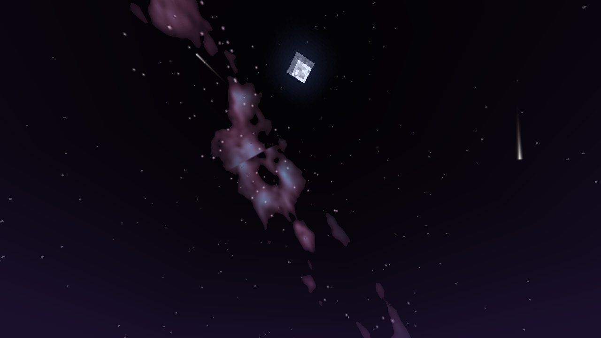 *A Starfall night: shooting stars and the nebula band* | 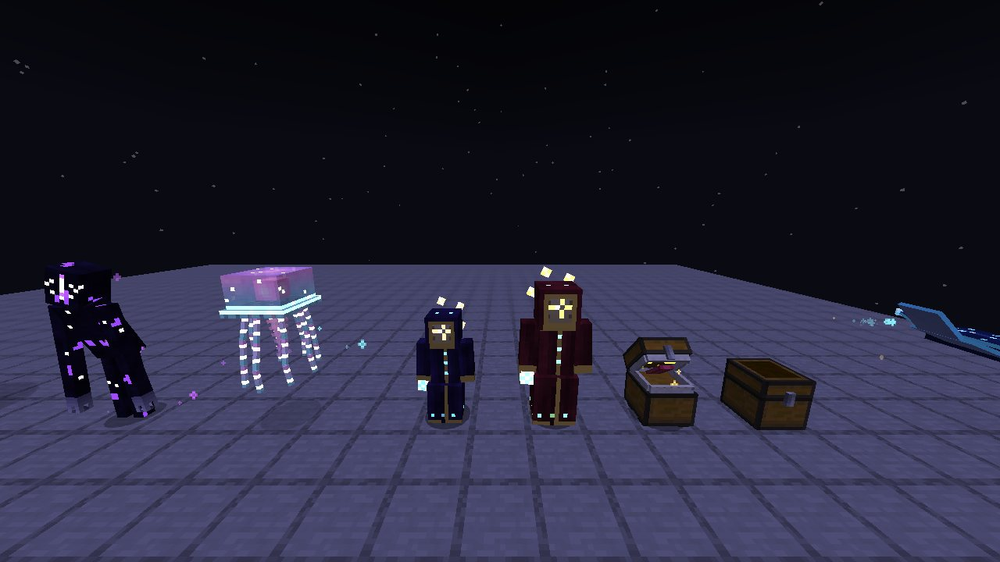 *Void Stalker, Nebula Jelly, Starseer, High Starseer, Astral Mimic, Comet Ray* |
| 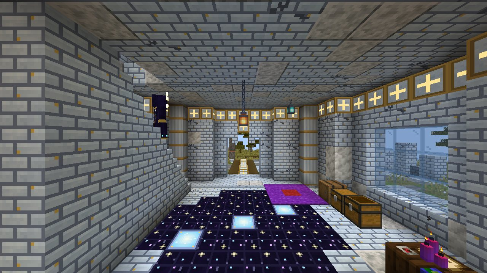 *Inside the Astral Observatory* | 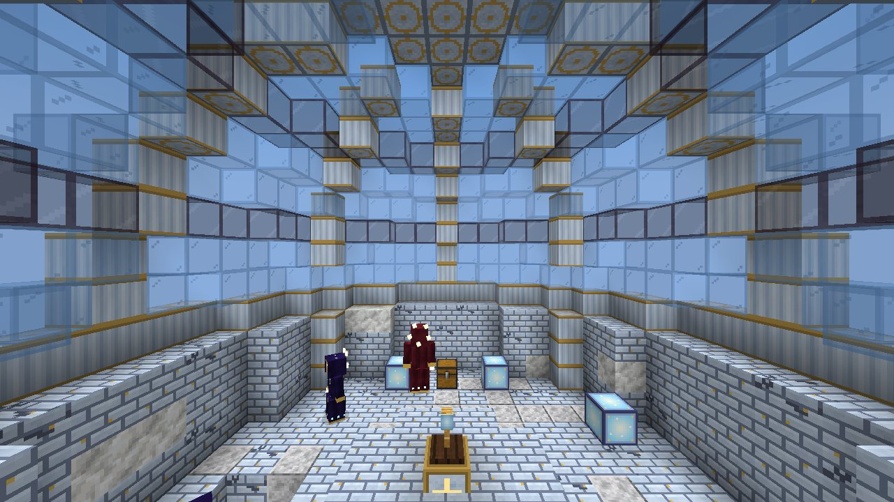 *The telescope dome and the High Starseer* |
| 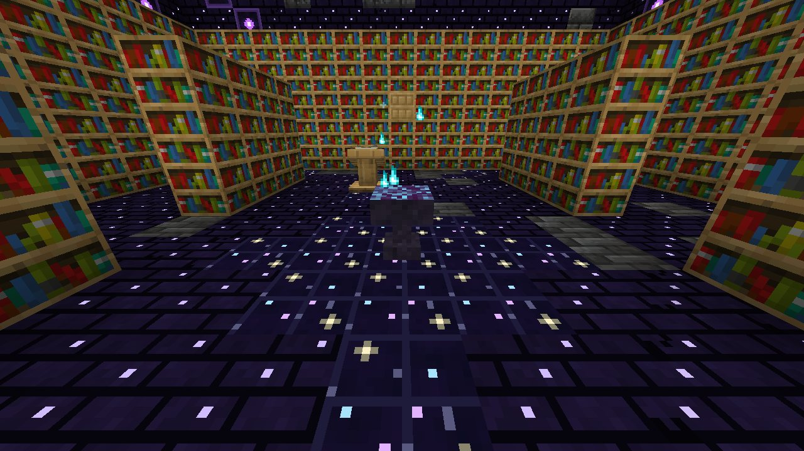 *The Sanctum library (and a lit seal brazier)* | 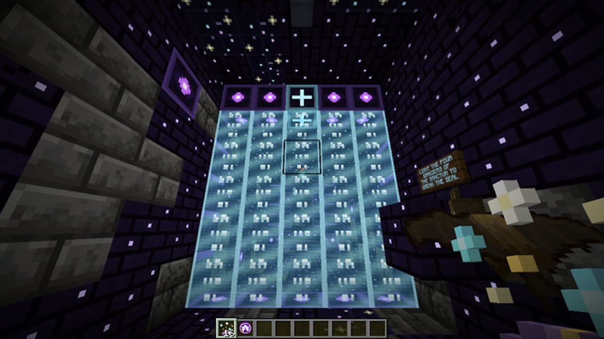 *The Sanctum Seal* |
| 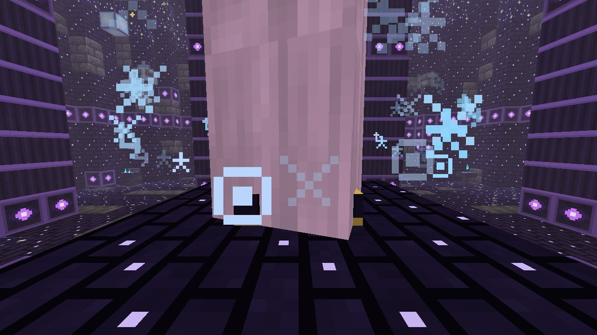 *The Sigil meets the Star Altar* | 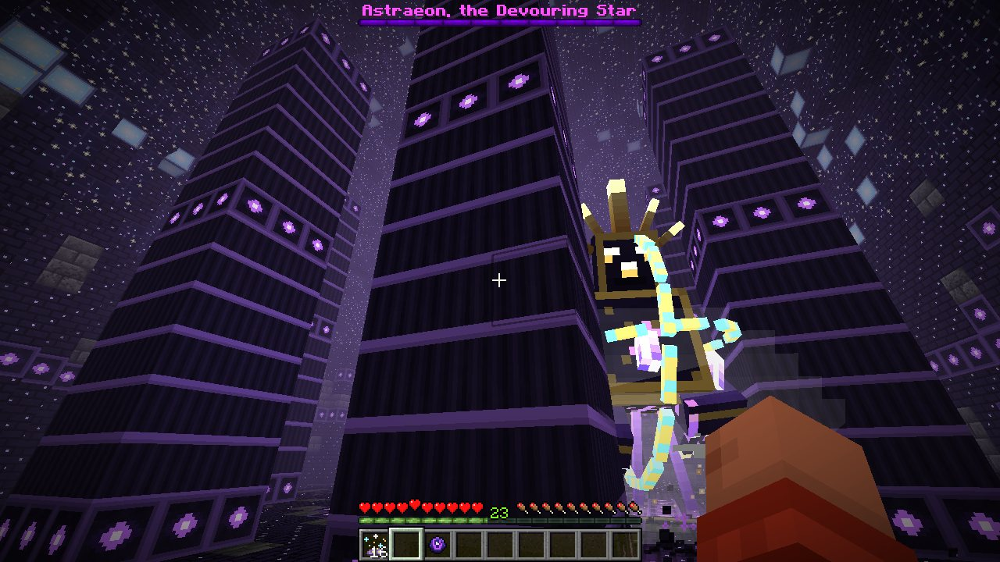 *Astraeon rises in the Heart Chamber* |
| 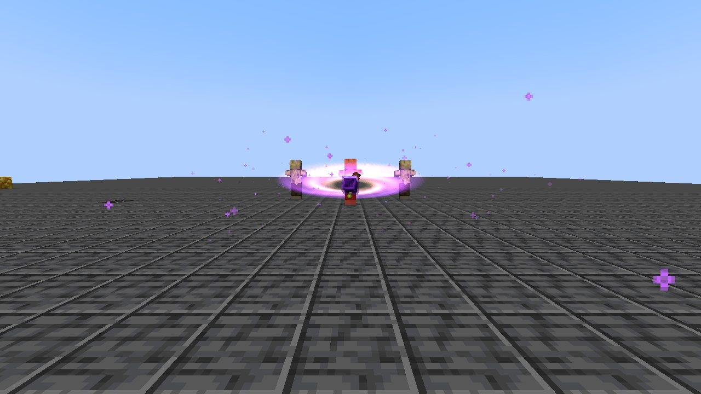 *Singularity Gauntlet black hole* | 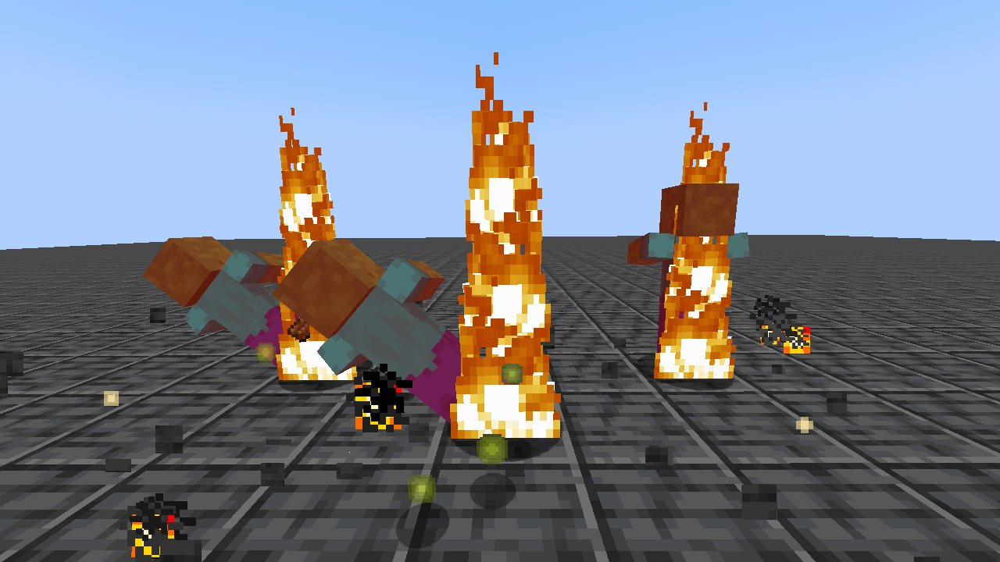 *Cratermaker slam* |
| 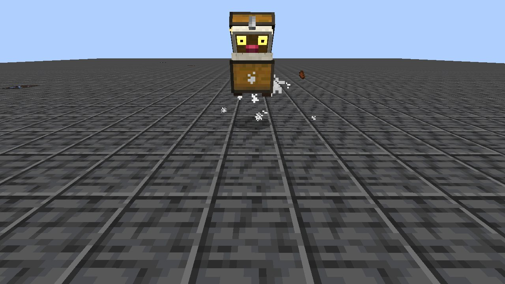 *Surprise!* | 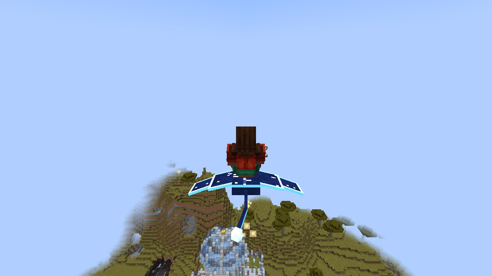 *Riding a Comet Ray* |
| 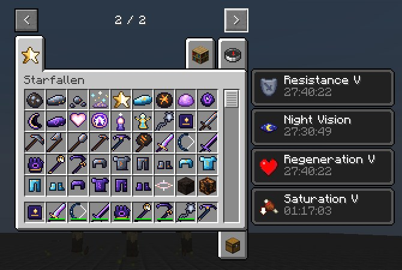 *The Starfallen creative tab* | 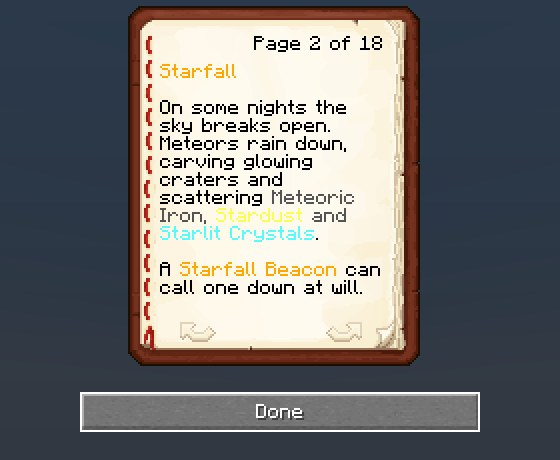 *The Starseer's Journal* |

---

## Configuration
`config/starfallen-common.toml`

| Key | Default | |
|---|---|---|
| `starfall.starfallChance` | `0.2` | Chance that a night is a Starfall night |
| `starfall.firstStarfallDay` | `1` | First in-game day a natural Starfall can happen |
| `starfall.meteorMinInterval` / `meteorMaxInterval` | `90` / `260` | Ticks between meteors per player during a Starfall |
| `starfall.meteorCraters` | `true` | Meteors carve craters (also follows the `mobGriefing` gamerule) |
| `starfall.goldenMeteorChance` | `0.04` | Chance of a Golden Meteor |
| `starfall.eggMeteorChance` | `0.12` | Chance a large meteor carries a Stellar Egg |
| `starfall.announceStarfall` | `true` | Title card and sound when a Starfall starts |
| `gear.staffCraters` | `true` | Starcaller Staff meteors carve small craters |
| `gear.bossHealthMultiplier` | `1.0` | Multiplies Astraeon's health (great for multiplayer) |
| `gear.haloFlight` | `true` | The Halo grants flight |

---

## Building from source
```
./gradlew build        # → build/libs/starfallen-1.0.0.jar  (Java 17)
```
All art and audio are generated by the Python scripts in `tools/` (Pillow, NumPy, SciPy, SoundFile):
`modelgen.py` (entity models and their textures), `texgen.py` (items, blocks, armor, particles, sky), `soundgen.py`
(all sound effects and the boss theme) and `datagen.py` (models, blockstates, recipes, loot, tags, advancements,
worldgen and the language file).

## License
MIT. All textures, models, sounds and music in this mod were generated for it and are covered by the same license.
